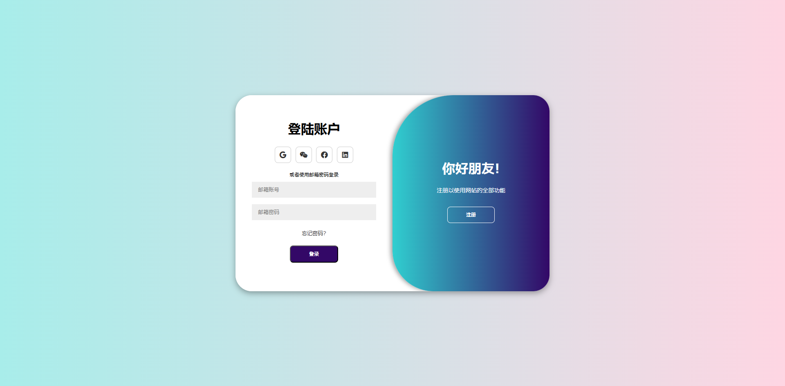
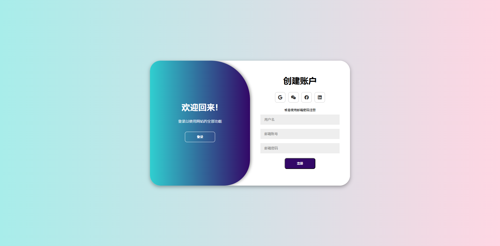

# Animated Login Page
### 截图

### 细节
- container 容器设置宽高，溢出时隐藏
- for-container 容器重叠，变化时往右平移
- toggle-container 容器设置最上层，显示内容
- toggle 容器拓展 200%，确保覆盖住 container 容器
- toggle-panel 容器在 toggle 的基础上进行定位
- 对于平移重叠的容器需要设置背景色，防止文字出现重叠阴影
- 平移过程使用动画进行精细控制